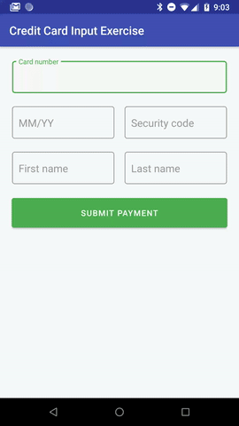

# Android Credit Card Input Exercise
 

### Introduction
This "Credit Card Input Exercise" was a from-scratch "take-home project" assigned to me by a company
I was interviewing with for an Android Developer role. They liked my submission well enough to bring me in for
onsites, so I thought I'd put it up on GitHub as another code sample, considering that absolutely
nothing about it is specific to that company (and for this repo I redid the README so it no longer contains
the quoted requirements/instructions from their specs document).

I'll probably update this project a little more once a stable release version of
com.google.android.material:material:1.1.0 comes out -- among other things it will add some additional features
to the TextInputLayout/TextInputEditText views.

### Requirements

Basically, they asked me to create an Android "screen" that would allow a user to enter and submit the
following data from an American Express, Discover, MasterCard, or Visa credit card: 
* Credit card number
* Expiration date (MM/YY format)
* CVV security code
* First name
* Last name

If any of the entered data was invalid, the user needed to be notified so they could correct it.
In addition to not having issues like empty fields or a badly-formed or expired expiration date,
credit card data also had to meet these criteria to be considered valid:
* Credit card numbers needed to be in valid American Express, Discover, MasterCard, or Visa format according
to the specs listed on https://www.cybersource.com/developers/getting_started/test_and_manage/best_practices/card_type_id/
* Credit card numbers also needed to pass Luhn validation - see https://en.wikipedia.org/wiki/Luhn_algorithm
* The CVV had to meet these criteria: https://www.cvvnumber.com/cvv.html
* First and last names could only contain characters that were "alphabetical and spaces". *(It's true that many
people have hyphens in their names as well, but for this assignment I wasn't going to go past what was called
for in the specs, ditto for dealing with "international characters" even though I have one in my own first name.)*

When the user submitted valid credit card data, the app should pop up an alert dialog notifying them that the
payment was successful.

Another requirement was that the app needed to be able to run on Android Jelly Bean release 1 and above.

They suggested that I include a README about my approach and reasoning when designing and creating the app
-- my submitted README included quoted paragraphs from their specs document, and a long list of
checked checkboxes in front of quoted lines from their specs document, in addition to the notes below.

### Notes

When designing this project there were some things I had very specific ideas about, and others which
I left in more general form because the specifics would depend on things like the look and feel and approach
of whatever app they were used in.

I wanted the credit card text input fields and button to be a little self-contained layout that could
easily be included as part of a variety of other screen layouts, and adjust its width accordingly -- you can
see the latter going on in landscape mode and on tablets, where the main layout adjusts the credit card
input's layout width by varying the percentage of layout width that it takes up.

I wanted the credit card input layout to be pleasant to look at and use. I used TextInputLayouts with the
text field EditTexts because they're very customizable with a lot of nice touches, and can easily incorporate
error messages for problems with individual field values in a way that's very clear and doesn't distract or get
in the way. I used green as the accent color because it's associated with money in a positive way, but it would
use whatever accent color was specified in an app's theme. 

One decision point with a filling-out-and-submitting-a-form example like this is when exactly you do
validation and how you display it. There are various tradeoffs, for exsmple having the submit button be
disabled until all fields contain valid data works, but can be confusing as to why the button isn't working, or
having real-time indicators for each field can be clear but also annoying if they show errors as soon as you
start typing. For this example I decided to use the simple approach of first having the EditTexts themselves
enforce limits on which characters you could enter and how many of them (for example with the credit card number
you can only enter numbers and no more than 19 of them), and then having the checks for valid card number,
expiration date, and CVV, and non-empty first and last name, only come into play when you actually try to submit
the data.  

I put the credit card field validation methods in the CreditCard class, so that they would be decoupled
from other parts of any code/application using them, and easy to test and update. 

I included a small number of unit tests incorporating sample valid card numbers and CVVs just as an example
-- if this was part of a real app then you would want to have additional examples of valid cardnumber/CVV
combinations and also invalid ones.

I extracted strings used in the app to the strings.xml resource file, so they would be easy to modify, and
to translate if supporting multiple languages. Likewise, I extracted values like margins and padding to
other resource files, making it easy to vary them for other configurations such as landscape and
tablet.
